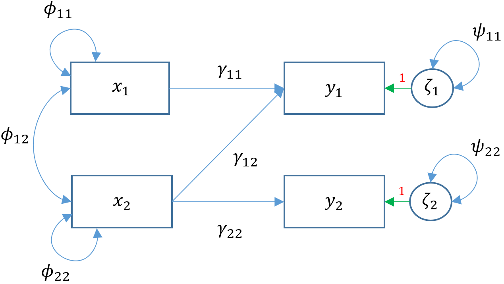

```{r setup, include=FALSE}
knitr::opts_chunk$set(echo = TRUE)
```

## Motivation

Angenommen, du bist ein Forscher, der die Auswirkungen der Herkunft der Schüler auf die schulischen Leistungen untersucht. Du bekommst ein Datensatz von Schülern mit jeweils 9 beobachteten Variablen hochgeladen: Motivation, Harmonie, Stabilität, negative elterliche Psychologie, SES, verbaler IQ, Lesen, Arithmetik und Rechtschreibung. Der Studienleiter geht von drei latenten Konstrukten aus: Anpassung, Risiko und Leistung, die mit der folgenden Codebuch-Zuordnung gemessen werden:

Anpassung

 - `motiv` Motivation
 - `harm` Harmony
 - `stabi` Stability
 
Risiko

 - `ppsych` (Negative) Parental Psychology
 - `ses` SES
 - `verbal` Verbal IQ
 
Leistung

 - `read` Reading
 - `arith` Arithmetic
 - `spell` Spelling
 
```{r, cache = TRUE, include=FALSE}

dat <- read.csv("https://stats.idre.ucla.edu/wp-content/uploads/2021/02/worland5.csv")

```

Anschauen des Datensatzes
```{r, cache=TRUE}
set.seed(42)    # Niemals vergessen!
summary(dat)

```

Die wichtigste Komponente eines Strukturgleichungsmodells ist die Kovarianz bzw. die statistische Beziehung zwischen den Größen.


Die wahre Kovarianz der Population, bezeichnet als bezeichnet, wird als Varianz-Kovarianz-Matrix bezeichnet. 
Da wir diese nicht wissen, müssen wir sie mit unserer Stichprobe schätzen die sogenannte Varianz-Kovarianz-Matrix der Stichprobe. 
Die Funktion `cov` gibt an, dass wir die Kovarianzmatrix aus den Daten erhalten wollen.

```{r, cache=TRUE}
cov(dat)
```

#### Interpretation

Die Diagonalen bilden die Varianzen der Items und die Off-Diagonalen die Kovarianzen. 
Beachte, dass die Varianz aller Variablen in unserer Studie zufällig 100 beträgt (entlang der Diagonalen). 
Betrachtet man die Beziehungen zwischen den Variablen (die Elemente auf den Außendiagonalen), so ist zu beachten, dass eine positive Kovarianz bedeutet, dass ein Element zunimmt, wenn das andere zunimmt, eine negative Kovarianz bedeutet, dass ein Element zunimmt, wenn das andere abnimmt. 
Die Kovarianz von `motiv` und `ppsych` beträgt `-25`, was bedeutet, dass die Motivation der Schüler mit zunehmender negativer elterlicher Psychologie abnimmt.

$\rightarrow$ Weiter in den Slides.

---

## Simple regression

Weiter mit dem Beispiel aus den Slides.

{width=60%}

Wir bauen ein einfaches Lineares Modell

```{r, cache=TRUE}
m1a <- lm(read ~ motiv, data=dat)
summary(m1a)
```

Wir können das selbe Modell auch mit dem `lavaan` Package bauen. 
Dieses Package ist extra dafür gebaut worden um SEMs zu bauen und zu nutzen.


```{r, eval=FALSE}
# Generelle Schreibweise:
## Modellgleichung
mgl <- '# regressions
       y ~ 1 + Variablen
       # variance (optional)
       Variable(n) ~~ Variable(n)'
## Modell Fitten
model <- sem(mgl, data=datensatz)

```


Die Syntax ist `lm()` insofern sehr ähnlich, als `read ~ motiv` den Prädiktor motiv auf das Ergebnis read angibt. 
Der Intercept ist jedoch standardmäßig nicht in der Ausgabe enthalten, sondern wird impliziert. 
Wenn wir einen Intercept hinzufügen wollen, müssen wir `read ~ 1 + motiv` einschließen. 
Optional können Sie die Varianz von motiv mit `motiv ~~ motiv` abfragen. Wenn diese Syntax nicht angegeben wird, wird der Parameter zwar geschätzt, aber nur implizit angegeben.


```{r, cache=TRUE}
library(lavaan)
fit1b <- sem(c('# Regressions part
                read ~ 1 + motiv
                # Varianz (optional)
                motiv ~~ motiv'), 
             data=dat)
summary(fit1b)

```

Der Achsenabschnitt von `.read (-0,000)` und der Regressionskoeffizient von `read ~ motiv (0,530)` entsprechen mit kleinen Rundungsfehlern der Ausgabe von `lm()`. 
Beachten Sie, dass das `.` vor dem Parameter eine endogene Variable unter Achsenabschnitte und eine Restvarianz unter Varianzen oder Kovarianzen angibt. 
Der Achsenabschnitt für das `motiv (0,000)` hat kein `.` und seine `Varianz (99,800)` auch nicht, was bedeutet, dass es sich um einen exogenen Mittelwert und eine exogene Varianz handelt. Der exogene Mittelwert und die exogene Varianz sollten eng mit dem univariaten Mittelwert (0) und der Varianz (100) übereinstimmen, wie unten gezeigt:

```{r, cache=TRUE}
mean(dat$motiv)
var(dat$motiv)

```

$\rightarrow$ Weiter in den Slides.

---

## Multiple regression

Die einfache Regression ist auf eine einzige exogene Variable beschränkt. In der Praxis kann ein Forscher daran interessiert sein, wie eine Gruppe von exogenen Variablen ein Ergebnis vorhersagt. Angenommen, wir haben immer noch ein endogenes Ergebnis, aber zwei oder mehr exogene Prädiktoren; dies wird als multiple Regression bezeichnet (nicht zu verwechseln mit multivariater Regression). Die Matrixform ermöglicht es uns, die Gleichung für alle Beobachtungen prägnant darzustellen
$$
  y_1 = \alpha_1 + \mathbf{x \gamma} + \zeta_1
$$

Angenommen, wir haben zwei exogene Variablen die eine einzige endogene Variable vorhersagen. 
Das Pfaddiagramm für diese multiple Regression (Modell 2) lautet

.png){width=60%}

Die Spezifikation einer multiplen Regression in Lavaan ist so einfach wie das Hinzufügen eines weiteren Prädiktors. Angenommen, der Forscher ist daran interessiert, wie negative elterliche Psychologie `ppsych` und `motiv` motivieren, die Leseergebnisse der Schüler vorherzusagen.

```{r, cache=TRUE}
m2 <- sem(c('# regressions
                read ~ 1 + ppsych + motiv
                # covariance
                ppsych ~~ motiv'), 
             data=dat)

fit2 <- sem(m2, data=dat)

summary(fit2)
```

$\rightarrow$ Weiter in den Slides.

---

Einfache und multiple Regression modellieren jeweils ein Ergebnis ($y$) zu einem Zeitpunkt. 
Bei der multivariaten oder simultanen linearen Regression werden mehrere Ergebnisse gleichzeitig modelliert $y_1, y_2, \dots, y_p$. 
Das allgemeine multivariate lineare Modell ist definiert als
$$\mathbf{y} = \mathbf{\alpha} + \mathbf{\Gamma} \mathbf{x} + \mathbf{\zeta}$$
Um die Matrixformulierung deutlicher zu sehen, betrachten Sie zwei (d. h. bivariate) endogene Variablen ($y_1, y_2$), die von zwei exogenen Prädiktoren $x_1, x_2$ vorhergesagt werden.
$$
  \begin{pmatrix}
    y_{1} \\
    y_{2}
  \end{pmatrix}
    =
  \begin{pmatrix}
    \alpha_1 \\
    \alpha_2
  \end{pmatrix}
    +
  \begin{pmatrix}
    \gamma_{11} & \gamma_{12}\\
    0 & \gamma_{22}
  \end{pmatrix}
  \begin{pmatrix}
    x_1 \\
    x_2
  \end{pmatrix}
    +
    
  \begin{pmatrix}
    \zeta_{1}\\
    \zeta_{2}
  \end{pmatrix}
$$

$\Gamma$ wird als Strukturparameter bezeichnet und definiert die Beziehung zwischen exogenen und endogenen Variablen.

```{r, cache=T}
m3a <- 'read ~ 1 + ppsych + motiv
        arith ~ 1 + motiv'
fit3a <- sem(m3a, data=dat)
summary(fit3a)
``` 

```{r, cache=T}
m3b <- lm(read ~ ppsych + motiv, data=dat)
(fit3b <- summary(m3b))

``` 

Führen wir nun das Modell von arith auf motiv in lm() aus

```{r, cache=T}
m3c <- lm(arith ~ motiv, data=dat)
(fit3c <- summary(m3c))

``` 

Wir sehen, dass der Koeffizient `read ~~ ppsych` in Lavaan `-0,216` beträgt, in Lavaan aber `-0,2747`.
Könnte dies ein Rundungsfehler sein? 
Betrachtet man außerdem die Standardfehler der Residuen, so stellt man fest, dass die Restvarianz von `arith` `8.008^2=64.12` was sich von der `lavaan`-Schätzung von `63.872` unterscheidet. 
Was könnte die Ursache für diesen Unterschied sein, wenn man weiß, was man aus dem vorherigen Abschnitt weiß? 


$\rightarrow$ Weiter in den Slides.

---

## Multivariate Regression zur Entfernung von Standardkovarianzen

Eine Antwort auf die obrige Frage ist dass `lm()` den Klein-Quadrate Schätzer benutzt, während `laavan`auf der Maximum-likelihood Methode basiert, daher der Unterschied in den Schätzungen der Restvarianz.
Unabhängig davon, welcher der beiden Schätzer verwendet wird, sollten die Regressionskoeffizienten jedoch unverzerrt sein, so dass der Unterschied in den Koeffizienten auf etwas anderes zurückzuführen sein muss.
Die Antwort liegt in der impliziten Tatsache, dass lavaan standardmäßig die Residualvarianzen der endogenen Variablen `.read ~~ .arith` kovariiert. Entfernt man die Standard-Residualkovarianzen, sieht man im Pfaddiagramm.

{width=60%}

Removing the covariance of `read` and `arith` is the same as fixing its covariance to zero through the following syntax `read ~~ 0*arith`.

```{r, cache=T}

m3d <- '# regressions
        read ~ 1 + ppsych + motiv
        arith ~ 1 + motiv
        # covariance
        read ~~ 0*arith 
        '

fit3d <- sem(m3d, data=dat)

summary(fit3d)

```

