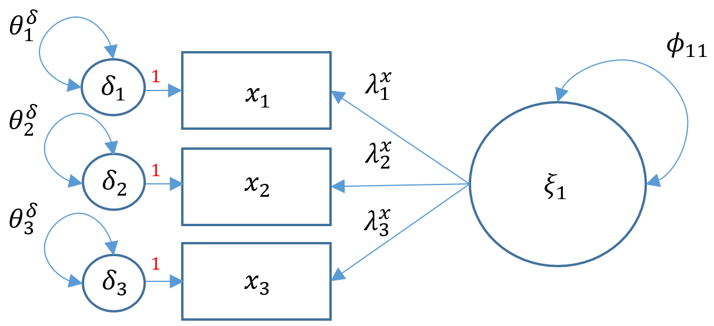
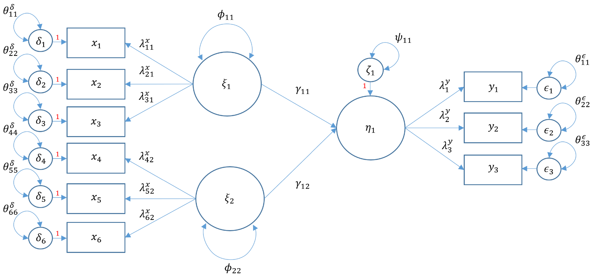

```{r setup, include=FALSE}
knitr::opts_chunk$set(echo = TRUE)
dat <- read.csv("https://stats.idre.ucla.edu/wp-content/uploads/2021/02/worland5.csv")

```

<<<<<<< HEAD
## Measurement Modelle

Wir haben bisher darüber gesprochen, wie man strukturelle Beziehungen zwischen beobachteten Variablen modelliert. 
Ein Messmodell oder Measurement Model, ist im Wesentlichen ein multivariates Regressionsmodell, bei dem der Prädiktor eine exogene oder endogene latente Variable (auch als Faktor bezeichnet) ist. Das Modell ist definiert als
$$
\mathbf{x= \tau_x + \Lambda_x \xi+ \delta}.
$$

**Definitionen**

 - $\mathbf{x} =(x_1, \cdots, x_q)’$ Vektor der Indikatoren.
 - $\mathbf{\tau_x}$ Vektor der Intercepte für die $x$-Indikatoren.
 - $\xi$ Vektor der latenten exogenen Variablen.
 - $\mathbf{\delta}= ( \delta_1, \cdots, \delta_q)’$ Vektor der Residuen.
 - $\mathbf{\Lambda_x}$ matrix der loadings der latenten exogenen Variablen.
 - $\mathbf{\theta_{\delta}}$ Varianz oder Kovarianz der Residuen für $x$-seitige Indikatoren.
 
 {width=60%}
 
Lasst uns sehen, wie wir eine Ein-Faktor-Messung in Lavaan mit verbalem IQ `verbal`, SES `ses` und negativer elterlicher Psychologie `ppsych` als Indikatoren für den Faktor (latente exogene Variable) Risiko `risk` durchführen können.

```{r, cache=TRUE}
library(lavaan)
m5a <- 'risk =~ verbal + ses + ppsych
        #intercepts (nu = tau) 
        verbal ~ 1
        ses ~ 1 
        ppsych ~ 1' 
fit5a <- sem(m5a, data=dat) 

summary(fit5a) 
summary(fit5a, standardized=TRUE) # standardisierte Varianzen

```

**Erklärung der Formel**

Die erste Zeile ist die "Modellaussage". 
Die Gleichung für diese "Indikatorgleich" wird bezeichnet durch `=~`, bei der die latente Variable auf der linken Seite und die Indikatoren (oder beobachteten Variablen) auf der rechten Seite des Symbols stehen. 
Hier modellieren wir explizit die Achsen der Indikatoren mit `verbal ~ 1`, `ses ~ 1` und `ppsych ~ 1`. 
Anschließend speichern wir das Modell im Objekt m5a für Modell 5A. 
Schließlich wird mit `summary(fit5a, standardized=TRUE)` eine Zusammenfassung der Analyse angefordert, wobei der verwendete Schätzer, die Anzahl der freien Parameter, die Teststatistik, die geschätzten Mittelwerte, die standardisierten Ladungen und, WICHTIG, die standardisierten Varianzen ausgegeben werden.


### Modelle zur endogenen Messung


$$
  \mathbf{y= \tau_y + \Lambda_y \eta + \epsilon}
$$

**Definitionen**

 - $\mathbf{y} =(y_1, \cdots, y_p)’$ Vektor der Indikatoren.
 - $\mathbf{\tau_x}$ Vektor der $p$ Intercepte für die $y$-Indikatoren.
 - $\eta$ Vektor der $m$ latenten endogenen Variablen.
 - $\mathbf{\epsilon}= ( \epsilon_1, \cdots, \epsilon_p)’$ Vektor der Residuen.
 - $\mathbf{\Lambda_y}$ matrix der loadings der latenten endogenen Variablen.
 - $\mathbf{\theta_{\epsilon}}$ Varianz oder Kovarianz der Residuen für $y$-seitige Indikatoren.
 
Der Hauptunterschied zwischen den Modellen 5A und 5B besteht einfach darin, dass es sich bei Modell 5A um eine exogene latente Faktorenanalyse handelt, während Modell 5B eine endogene latente Faktorenanalyse ist, was bedeutet, dass sie durch eine andere latente Variable vorhergesagt wird. Da wir derzeit keine Prädiktoren für 
haben, ist dies nur ein hypothetisches Modell. Im folgenden Abschnitt über strukturelle Regression werden wir eine endogene latente Variable mit realen Daten modellieren. Exogene latente Messmodelle werden als x-seitige Variablen klassifiziert, die in einem Pfaddiagramm nach links zeigen, und endogene latente Messmodelle werden als y-seitige latente Variablen bezeichnet, die in einem Pfaddiagramm nach rechts zeigen.

Bis zu diesem Punkt haben wir uns mit multivariaten Messmodellen beschäftigt, die die Beziehung zwischen Indikatoren und latenten Variablen definieren, sowie mit multivariaten Regressions- und Pfadmodellen, die die kausale Beziehung zwischen beobachteten endogenen und exogenen Variablen definieren. Im nächsten Abschnitt werden wir sehen, wie strukturelle Regressionsmodelle es uns ermöglichen, Beziehungen zwischen exogenen und endogenen latenten Variablen zu modellieren.

---

## Stukturgleichungsmodelle

Bislang haben wir alle einzelnen Komponenten erörtert, aus denen sich das strukturelle Regressionsmodell zusammensetzt. 
Die multivariate Regression ist eine Regression mit simultanen endogenen Variablen beinhaltet und die Pfadanalyse erklärende endogene Variablen zulässt. 
Die konfirmatorische Faktorenanalyse ist ein Messmodell, das latente Variablen mit Indikatoren verknüpft. 
Die strukturelle Regression schließlich vereinigt das Mess- und das Strukturmodell, um erklärende latente Variablen zu berücksichtigen, unabhängig davon, ob sie endogen oder exogen sind.


Latentes exogenes Modell
$$
  \mathbf{x= \tau_x + \Lambda_x \xi+ \delta}
$$

Latentes endogenes Modell
$$
  \mathbf{y= \tau_y + \Lambda_y \eta + \epsilon}
$$
Strukturgleichung
$$
  \mathbf{\eta = \alpha + B \eta + \Gamma \xi + \zeta}
$$


**Definitionen**

*Messungs Variablen*

 - $\mathbf{y} =(y_1, \cdots, y_p)’$ Vektor der Indikatoren.
 - $\mathbf{x} =(x_1, \cdots, x_q)’$ Vektor der Indikatoren.
 - $\mathbf{\tau_x}$ Vektor der $p$ Intercepte für die $y$-Indikatoren.
 - $\mathbf{\tau_y}$ Vektor der Intercepte für die $y$-Indikatoren.
 - $\xi$ Vektor der latenten exogenen Variablen.
 - $\eta$ Vektor der $m$ latenten endogenen Variablen.
 - $\mathbf{\delta}= ( \delta_1, \cdots, \delta_q)’$ Vektor der $x$-seitigen Residuen.
 - $\mathbf{\epsilon}= ( \epsilon_1, \cdots, \epsilon_p)’$ Vektor der $y$-seitigen Residuen.
 - $\mathbf{\Lambda_y}$ matrix der loadings der latenten endogenen Variablen.
 - $\mathbf{\Lambda_x}$ matrix der loadings der latenten exogenen Variablen.
 - $\mathbf{\theta_{\epsilon}}$ Varianz oder Kovarianz der Residuen für $y$-seitige Indikatoren.
 - $\mathbf{\theta_{\delta}}$ Varianz oder Kovarianz der Residuen für $x$-seitige Indikatoren.
 
*Strukturelle Variablen*

 - $\alpha$ Vektor der Intercepts
 - $\Gamma$ Matrix von Regressionskoeffizienten von latent exogenen zu latent endogenen Variablen.
 - $B$ Matrix von Regressionskoeffizienten von latent endogenen zu latent endogenen Variablen.
 - $\zeta= ( \zeta_1, \cdots, \zeta_m)’$ Vektor der Residuen für die latente endogene Variable.
 
*Annahmen*

 - $\eta$ und $\xi$ sind NICHT beobachtbar.
 - $\epsilon$ und $\delta$ sind Fehler der Messungen von $y$ und $x$.
 - $\epsilon$ ist unkorreliert zu $\delta$.
 

---
 
Verwenden wir nun `lavaan`, um Modell mit unserem Datensatz zu implementieren.
Die erste latente exogene Variable $\xi_1$ bestehend aus drei $x$-Seitenindikatoren - Motivation, Harmonie und Stabilität, `adjust =~ motiv + harm + stabi`.
Die zweite latente exogene Variable $\xi_2$ bestehend aus drei weiteren $x$-Seitenindikatoren - Verbaler IQ, negative elterliche Psychologie und SES, `risk =~ verbal + ppsych + ses`.
Dann gehen wir zur einzigen endogenen Variablen, Leistung ($\eta_1$) mit den drei $y$-seitigen Indikatoren Lesen, Rechnen und Rechtschreibung erreichen `achieve =~ read + arith + spell`.
Schließlich wollen wir die strukturelle Regression aufstellen. Wir stellen die Hypothese auf, dass Anpassung die Leistung der Schüler positiv und Risiko negativ vorhersagt, und in Lavaan geben wir `achieve ~ adjust + risk` an.

{width=80%} 


 
**Wie baut man nun ein Modell?**

Um das vollständige strukturelle Regressionsmodell zu spezifizieren, ist es intuitiver, mit dem Messmodell zu beginnen und dann zu spezifizieren, wie sich die latenten Variablen zueinander verhalten (das strukturelle Modell). Damit die latenten exogenen Variablen die latenten endogenen Variablen erklären können, müssen zwei separate Messmodelle erstellt werden.

### 1. Schritt: latente-exogene Messmodell

Spezifizieren wir zunächst das latente exogene Messmodell mit sechs Items, wobei die ersten drei $x$-seitigen Indikatoren ($x_1, x_2, x_3$) gemessen werden durch $\xi_1$ und die letzten drei ($x_4, x_5, x_6$) gemessen werden durch $\xi_2$.

Nachdem wir nun das exogene Messmodell aufgestellt haben, wollen wir uns dem endogenen Messmodell zuwenden. Die drei $y$-seitigen Indikatoren werden durch einen Faktor gemessen $\eta_1$. 


In R sieht das Measurement-Teil des Modells wie folgt aus:

```{r, eval=FALSE}
adjust =~ motiv + harm + stabi    # exogenes Messmodell 1
risk =~ verbal + ppsych + ses     # exogenes Messmodell 2
achieve =~ read + arith + spell   # endogenen Messmodell
```


### 2. Schritt: Das Strukturgleichungsmodell

In R sieht der Struktur-Teil des Modells wie folgt aus:
```{r, eval=FALSE}
achieve ~ adjust + risk
```

Mit diesen Modellteilen können wir das Modell bauen

```{r, cache=TRUE}

m6a <- '
# measurement model
adjust =~ motiv + harm + stabi
risk =~ verbal + ppsych + ses
achieve =~ read + arith + spell
# regressions
achieve ~ adjust + risk
'

fit6a <- sem(m6a, data=dat)

summary(fit6a, standardized=TRUE, fit.measures=TRUE)

```
=======
## 
>>>>>>> e2c1b1e9bdb6f3e33d3bba66ec99e307d67cf6e8
